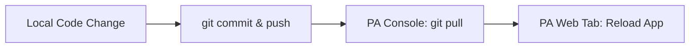

# Deploying StudyHub College on PythonAnywhere Free Tier

This guide provides step-by-step instructions to host and run a small free-tier pilot of **StudyHub College** using a free PythonAnywhere account and SQLite.

> [!WARNING]
> PythonAnywhere Free Tier accounts have a **512 MiB disk quota**. PDF uploads (study materials and PYQs) can fill this space quickly. Instruct admins to upload small files, and ensure regular backups are performed.

---

## Step-by-Step Deployment Guide

### 1. Create a PythonAnywhere Account
1. Go to [PythonAnywhere](https://www.pythonanywhere.com/) and register for a **Free / Beginner** account.
2. Your website URL will be `http://<your-username>.pythonanywhere.com`.

### 2. Clone the Repository
1. Log into PythonAnywhere and navigate to the **Consoles** tab.
2. Start a new **Bash** console.
3. Clone your GitHub repository:
   ```bash
   git clone https://github.com/<your-github-username>/studyhub-college.git
   cd studyhub-college
   ```

### 3. Create a Virtual Environment & Install Dependencies
1. PythonAnywhere provides virtualenv wrappers. Run the following in your Bash console:
   ```bash
   mkvirtualenv studyhub-env --python=python3.10
   ```
   *Note: This creates and automatically activates the virtualenv located at `/home/<your-username>/.virtualenvs/studyhub-env`.*
2. Install the project dependencies:
   ```bash
   pip install -r requirements.txt
   ```

### 4. Configure Environment Variables
1. Create a `.env` file from the example configuration:
   ```bash
   cp .env.example .env
   ```
2. Open the `.env` file using the PythonAnywhere file editor or nano:
   ```bash
   nano .env
   ```
3. Set the variables:
   * Change `FLASK_DEBUG` to `False` (for production safety).
   * Replace `SECRET_KEY` with a strong random string:
     ```bash
     python -c "import secrets; print(secrets.token_hex(24))"
     ```
   * Leave `DATABASE_URL` commented out to automatically fall back to SQLite, which will create the database inside the `instance/` folder.

### 5. Initialize the Database & Seed Content
1. Run the database setup script to create tables:
   ```bash
   python migrate_db.py
   ```
2. Seed the database with the core subjects, units, quizzes, and default test accounts:
   ```bash
   python seed.py
   ```
3. Create your first real Platform Admin account securely:
   ```bash
   python create_admin.py --name "Super Admin" --email "admin@studyhub.local" --password "choose_a_secure_password"
   ```

### 6. Configure the Web App (Web Tab)
Go to the **Web** tab in the PythonAnywhere dashboard and click **Add a new web app**:
1. Select **Manual Configuration** (do NOT choose Django or Flask quickstarts).
2. Select **Python 3.10**.
3. In the Web settings tab, configure:
   * **Source code**: `/home/<your-username>/studyhub-college`
   * **Working directory**: `/home/<your-username>/studyhub-college`
   * **Virtualenv**: `/home/<your-username>/.virtualenvs/studyhub-env`

### 7. Configure the WSGI File
1. Under the **Code** section in the **Web** tab, click on the **WSGI configuration file** link (it looks like `/var/www/<your-username>_pythonanywhere_com_wsgi.py`).
2. Delete everything inside, replace it with the following block, and click **Save**:
   ```python
   import sys
   import os
   from dotenv import load_dotenv

   # Add project directory to sys.path
   project_home = '/home/<your-username>/studyhub-college'
   if project_home not in sys.path:
       sys.path.insert(0, project_home)

   # Load environment variables from .env
   load_dotenv(os.path.join(project_home, '.env'))

   # Import Flask application factory
   from app import create_app
   application = create_app()
   ```

### 8. Set Up Static Files Mapping
PythonAnywhere serves static files directly via Nginx, which is faster and reduces Flask worker load.
1. Scroll down to the **Static files** section of the **Web** tab.
2. Add the following entry:
   * **URL**: `/static/`
   * **Directory**: `/home/<your-username>/studyhub-college/app/static`
3. Click the checkbox next to it to save the path.

### 9. Reload and Test
1. Scroll to the top of the **Web** tab and click the green **Reload** button.
2. Visit `http://<your-username>.pythonanywhere.com/` in your browser.
3. Validate that you can load the landing page, log in, and browse subjects.

---

## How to Update Live Website After Code Changes

When you make local code changes in VS Code, follow this workflow to safely deploy updates:



### Steps:
1. **Push Changes from Local Machine**:
   ```bash
   git add .
   git commit -m "Explain your code change"
   git push origin main
   ```
2. **Pull Changes on PythonAnywhere**:
   * Open the PythonAnywhere Bash console.
   * Pull the latest code:
     ```bash
     cd ~/studyhub-college
     git pull
     ```
3. **Handle Dependencies (If Changed)**:
   If you modified `requirements.txt`, reinstall them inside the active virtualenv:
   ```bash
   workon studyhub-env
   pip install -r requirements.txt
   ```
4. **Handle Database Changes (If Models Changed)**:
   If models were added or modified, run migrations or apply schema changes:
   ```bash
   python migrate_db.py
   ```
5. **Reload the App**:
   Go to the PythonAnywhere **Web** tab and click **Reload**.

---

## Free-Tier Warnings & Backup Strategy

> [!IMPORTANT]
> Keep the following guidelines in mind to keep your Free Tier app running smoothly:
>
> 1. **Storage Limits**: Free accounts get **512 MiB**. With a 5 MB upload limit, you can store around 80-90 study resources before hitting quotas. Ask instructors to optimize PDFs (compress image DPIs) before uploading.
> 2. **Ephemeral Uploads / Database**: Ensure you regularly backup the SQLite database file and uploads folder.
> 3. **Pilot Scaling**: If the testing expands beyond 10-15 students or needs persistent file storage, upgrade to a paid PythonAnywhere plan or a dedicated VPS.

### Simple Backup Script
You can periodically run this command in your PythonAnywhere console to create a zipped backup:
```bash
zip -r backup_$(date +%F).zip instance/studyhub.db uploads/
```
Download the resulting zip file via the **Files** tab on PythonAnywhere to keep a copy on your local machine.

---

## Common Errors & Fixes

* **502 Bad Gateway**:
  * *Cause*: Flask app crashed on startup.
  * *Fix*: Scroll to the bottom of the **Web** tab, click **Error log**, and check the traceback. Common causes include missing environment variables or circular imports.
* **403 Forbidden on static files**:
  * *Cause*: Incorrect path in static files mapping or folder permissions.
  * *Fix*: Ensure the directory path is absolute: `/home/<your-username>/studyhub-college/app/static`.
* **Database Locked Error**:
  * *Cause*: Concurrent SQLite writes.
  * *Fix*: Since SQLite is single-write, avoid running heavy background scripts while users are active.
