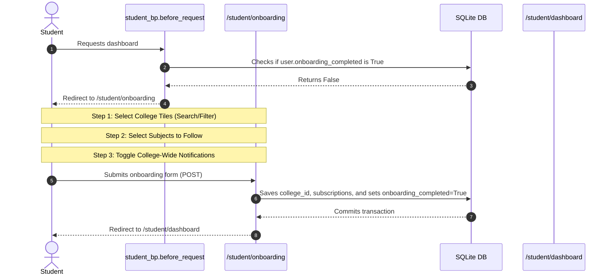

# Student Onboarding & Subscription Flow Plan

> [!NOTE]
> Student onboarding/subscription database foundation added. Routes/UI/notification logic not implemented yet.

This document outlines the design, architecture, routes, database schema, and notification logic to provide a clean, modern, and user-friendly onboarding experience for students on **StudyHub College**.

---

## 1. Database & Model Changes

### A. User Profile Fields
To track the student's onboarding and registration state, we add the following fields to the `User` model in `app/models.py`:
* **`onboarding_completed`** (`db.Boolean`, default=`False`, nullable=False): Tracks whether a student has completed their first-time college selection, followed subjects, and notification preferences. If `False`, they will be redirected to the onboarding wizard.
* **`profile_completed`** (`db.Boolean`, default=`False`, nullable=False): Tracks whether the student's profile setup is finalized.

### B. College Subscription Model
To allow students to subscribe to all updates from their selected college, we will introduce a new model **`CollegeSubscription`** in `app/models.py`.
```python
class CollegeSubscription(db.Model):
    __tablename__ = 'college_subscriptions'
    id = db.Column(db.Integer, primary_key=True)
    user_id = db.Column(db.Integer, db.ForeignKey('users.id'), nullable=False)
    college_id = db.Column(db.Integer, db.ForeignKey('colleges.id'), nullable=False)
    created_at = db.Column(db.DateTime, default=datetime.utcnow)

    __table_args__ = (db.UniqueConstraint('user_id', 'college_id', name='_user_college_uc'),)

    user = db.relationship('User', backref=db.backref('college_subscriptions', cascade='all, delete-orphan'))
    college = db.relationship('College', backref=db.backref('subscriptions', cascade='all, delete-orphan'))
```

### C. Reuse Existing SubjectSubscription
The existing `SubjectSubscription` model will be reused as-is to handle individual subject follows/unfollows.
```python
# Reused as-is
class SubjectSubscription(db.Model):
    __tablename__ = 'subject_subscriptions'
    ...
```

---

## 2. Route Plan
The onboarding and subscription flows will be managed by the following endpoints in `app/routes/student.py`:

* **`GET /student/onboarding`**
  * Renders the unified multi-step onboarding page.
  * Displays a progress bar and three distinct steps:
    1. **College Selection:** Searchable grid of active college cards.
    2. **Subject Selection:** Checkbox list of subjects belonging to the chosen college.
    3. **Preferences:** Checkbox option to follow all updates from the selected college.
* **`POST /student/onboarding`**
  * Processes the submitted onboarding form.
  * Steps:
    1. Sets `current_user.college_id` to the selected college.
    2. Registers `SubjectSubscription` records for all checked subjects.
    3. Creates a `CollegeSubscription` record if the college notifications checkbox is checked.
    4. Sets `current_user.onboarding_completed = True`.
    5. Redirects to `/student/dashboard`.
* **`POST /student/colleges/<int:id>/follow`**
  * Toggles (subscribes/unsubscribes) the `CollegeSubscription` for the student's linked college.
  * Supports AJAX JSON response for real-time UI updates.
* **`POST /student/subjects/<int:id>/follow`**
  * Toggles (subscribes/unsubscribes) the `SubjectSubscription` for a specific subject.
  * Supports AJAX JSON response for real-time UI updates.
* **`POST /student/onboarding/skip`**
  * Allows students to bypass the wizard. Sets default preferences (college assigned to their profile, no subject subscriptions, no college updates) and marks `onboarding_completed = True`.

---

## 3. Onboarding Flow Design


---

## 4. UI/UX Interface Guidelines

We will adhere strictly to the "Modern Minimal SaaS" theme.

### A. Onboarding Steps
* **Progress Bar:** A clean top tracker indicating `Step 1: College Selection`, `Step 2: Choose Subjects`, and `Step 3: Preferences`.
* **College Selection:** A grid of cards with college logos (and initials fallback). Real-time searching uses client-side JavaScript to filter tiles instantly by name, code, city, or state. Selecting a card highlights it with an Indigo border and checks a hidden input.
* **Subject Selection:** Renders subject cards grouped by semester. Each card features a checkbox and summary details (Subject Code, Semester).
* **College Updates:** A toggle switch styled with CSS to follow/unfollow the college.

### B. Dashboard Changes
* **College Card:** Displayed at the top of the student dashboard, featuring the selected college's logo, details, and a quick "Follow College Updates" toggle button.
* **Followed Subjects:** The dashboard will display **only** followed subjects to keep it focused.
* **Empty State:** If a student does not follow any subjects, a clean placeholder card will be displayed, guiding them with a "Find & Follow Subjects" button that links to the Subjects Directory.
* **Onboarding Banner:** A small dismissible notification alert reminding them they can reconfigure their preferences in `/student/profile` at any time.

---

## 5. Notification Logic
To prevent duplicate notifications when a student is subscribed to both the college and individual subjects within it, we will query notifications using a unified SQL query.

### A. Notification Dispatching
* When a college admin publishes content (material, PYQ, or quiz), a single `Notification` row is inserted:
  ```python
  notification = Notification(
      college_id=college_id,
      subject_id=subject_id,
      ...
  )
  ```

### B. Fetching Notifications (Avoiding Duplicates)
* We retrieve notifications for a student based on:
  * Their `college_id`.
  * If they have a `CollegeSubscription`, return **all** notifications for that `college_id`.
  * If they do **not** have a `CollegeSubscription`, return **only** notifications for the specific `subject_id`s they follow in `SubjectSubscription`.
* **SQL Query Structure:**
  ```python
  # Check if student follows whole college
  has_college_sub = CollegeSubscription.query.filter_by(
      user_id=current_user.id, 
      college_id=current_user.college_id
  ).first() is not None

  if has_college_sub:
      # Retrieve all notifications from this college
      notifications_query = Notification.query.filter(
          Notification.college_id == current_user.college_id
      )
  else:
      # Retrieve notifications only for subscribed subjects
      sub_subject_ids = [s.subject_id for s in current_user.subscriptions]
      notifications_query = Notification.query.filter(
          Notification.college_id == current_user.college_id,
          Notification.subject_id.in_(sub_subject_ids)
      )

  notifications = notifications_query.order_by(Notification.created_at.desc()).all()
  ```
* Since the filter resolves to a single query on the `Notification` table, it naturally deduplicates alerts!

---

## 6. Implementation Stages & Tokens

To manage scope safely and keep the project compile-ready at all times, we will implement this feature in the following order:

* **Step 1: Database Models & Migrations**
  * Update `User` and create `CollegeSubscription` in `app/models.py`.
  * Write and run the SQLite schema migration script `migrate_student_onboarding.py`.
* **Step 2: Onboarding Controller & Redirects**
  * Add the global onboarding check in `student_bp.before_request`.
  * Implement the `/student/onboarding` GET and POST routes in `app/routes/student.py`.
* **Step 3: Onboarding UI Templates**
  * Create `app/templates/student/onboarding.html` using a multi-step layout.
* **Step 4: AJAX Subscription Toggles**
  * Implement `/student/colleges/<id>/follow` and `/student/subjects/<id>/follow` routes and add frontend JS click triggers.
* **Step 5: Notifications Logic Refactoring**
  * Update `User.get_unread_notification_count()` in `app/models.py`.
  * Update `notifications()` and `read_all_notifications()` endpoints in `app/routes/student.py`.
* **Step 6: Dashboard Customizations & QA**
  * Clean up `dashboard.html` to show followed subjects and college subscriptions, and test the full onboarding experience.
